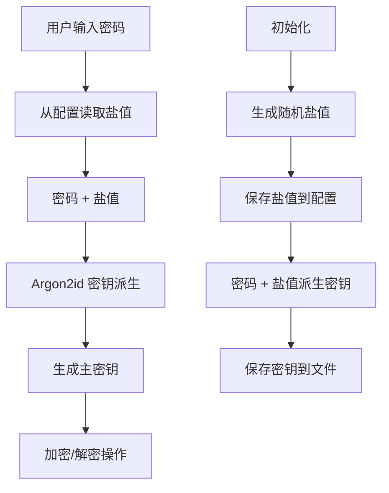

## 🔐 安全特性

### 密码学算法
- **文件加密**: AES-256-GCM（认证加密）
- **密码存储**: Argon2id（随机盐值，抗 GPU 攻击）
- **密钥派生**: Argon2id（用于备份文件加密）

### 安全限制
- **密码强度**: 至少 8 位，包含数字和字母
- **尝试限制**: 密码验证最多 3 次
- **危险路径保护**: 默认包含16个系统目录，禁止加密
- **最大文件大小**: 默认10GB限制，防止意外加密大文件
- **初始化要求**: 必须先初始化才能执行加密操作
- **文件权限保护**: 自动设置配置文件权限为 600（仅所有者可读写）
- **运行时安全检查**: 自动检测配置文件权限问题并警告

### 文件处理
- **扩展名保留**: `a.txt` → `a.txt.leo` → `a.txt`
- **递归处理**: 支持文件夹的递归加密/解密
- **宽松错误处理**: 单个文件失败不影响其他文件
- **安全删除**: 默认覆盖数据后删除源文件
- **符号链接安全**: 加密源文件，检测循环链接

### 配置管理
#### 默认配置
```toml
# ~/.config/leolock/config.toml
# 危险路径列表（禁止处理的系统目录）
forbidden_paths = [
    "/bin", "/sbin", "/usr/bin", "/usr/sbin",
    "/lib", "/lib64", "/usr/lib", "/usr/lib64",
    "/boot", "/dev", "/proc", "/sys", "/run",
    "/etc", "/root", "/var", "/tmp",
]

# 最大文件大小（字节），0表示无限制
max_file_size = 10737418240  # 10GB

# 是否启用进度显示
show_progress = true

# 默认加密文件后缀
default_extension = ".leo"

# 密钥文件位置（支持 ~ 扩展）
key_file_path = "~/.config/leolock/keys.toml"

# 盐值（base64编码，用于密钥派生）
salt = "EcwA1CVMrpIx2zbFCWegHw=="

# 是否已初始化
initialized = true

# 是否保留原文件名（false=加密文件名，true=保留文件名）
preserve_original_filename = false

# 加密文件格式版本
file_format_version = 2
```

#### 配置特性
1. **安全优先**: 默认包含所有关键系统目录作为危险路径
2. **环境变量覆盖**: 
   - `LEOLOCK_FORBIDDEN_PATHS`: 用逗号分隔的危险路径列表
   - `LEOLOCK_MAX_FILE_SIZE`: 最大文件大小（字节）
3. **配置文件搜索路径**（按优先级）:
   - `.leolock.toml`（当前目录）
   - `LEOLOCK_CONFIG` 环境变量指定的路径
   - `~/.config/leolock/config.toml`（XDG配置目录）
   - `~/.leolock.toml`（用户主目录）
4. **盐值存储**: 随机盐值存储在配置文件中，用于密钥派生
5. **初始化状态**: 配置加载时自动检测是否已初始化
6. **文件权限保护**: 自动设置配置文件权限为 600（仅所有者可读写）

#### 密码管理架构


**优势**:
- ✅ 无需单独的密码哈希文件
- ✅ 密码直接用于密钥派生，减少中间步骤
- ✅ 随机盐值确保每个实例唯一性
- ✅ 配置文件权限保护防止盐值泄露

